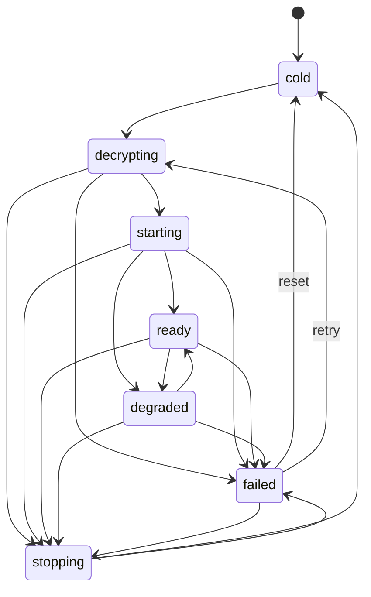
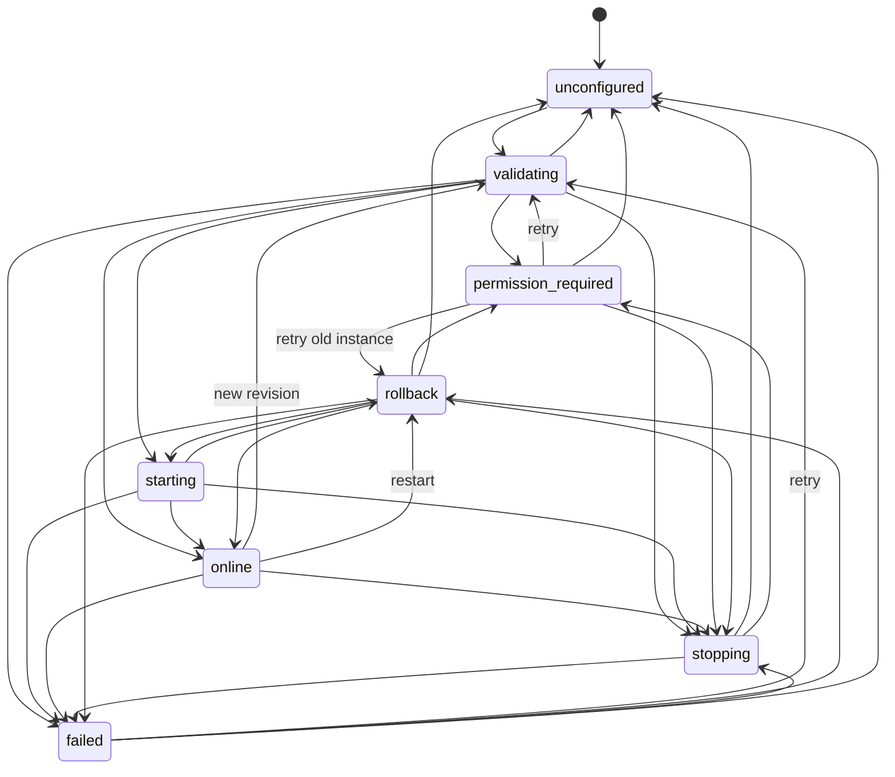

# 模块 02：共享架构

## 模块目标

建立五平台共用的 Tauri 2 workspace、类型化命令、双平面状态机和窄平台 adapter，使 UI、业务 API 与系统特权实现解耦。

## 目录目标

```text
orange/
  src/                         React/TypeScript
  src-tauri/                   Tauri app + Rust application layer
  crates/orange-domain/        DTO、状态机、错误
  crates/orange-bootstrap/     解密与 BootstrapTransport
  crates/orange-platform/      PlatformVpnAdapter trait
  native/android/              Kotlin plugin/VpnService
  native/apple/                Swift extension/helper
  native/windows/              Windows service/helper
  native/linux/                Linux helper/polkit/systemd
  docs/
```

实际初始化时可按 Tauri 约束调整目录，但边界不可合并成一个包含 UI、密钥和特权操作的模块。

## ARC-G0-001：五平台 Workspace 与工具链

**目标**：建立可复现的 Tauri 2 跨平台空壳和依赖锁。

**依赖**：`SEC-G0-001`。

**交付物**：workspace、工具链版本文件、五平台构建任务、基础 CI。

**验收规则**：

1. Windows/Linux/macOS 桌面空壳可启动，Android/iOS 真机或模拟器可打开首屏。
2. Node/pnpm/Rust/Go/JDK/NDK/Xcode 最低与推荐版本均有记录；不匹配时预检脚本明确失败。
3. TypeScript strict、ESLint、格式化、Vitest、`cargo fmt/clippy/test` 和 Go 检查进入 CI。
4. 全新 clone 不依赖开发者机器的全局隐藏配置即可完成至少当前平台 debug 构建。
5. secret、签名、provisioning profile 和 bootstrap key 不进入 Git 或构建日志。
6. `resources-manifest.json` schema 能在空壳构建中运行。

**非目标**：不要求此切片建立真实 VPN。

## ARC-G0-002：类型化 DTO、错误与命令边界

**目标**：统一 React、Rust、Go/Kotlin/Swift/helper 之间的数据契约。

**依赖**：`ARC-G0-001`。

**交付物**：DTO schema、错误码表、命令注册、序列化契约测试。

**验收规则**：

1. 所有 Tauri command 使用明确 request/response DTO，不传递任意 JSON map、文件路径或 shell 字符串。
2. 错误至少区分 validation、permission、network、bootstrap、subscription、service、timeout、cancelled、internal。
3. 错误给 UI 的 message 不包含 secret；可诊断 detail 只进入脱敏 debug 日志。
4. DTO 有版本字段或兼容策略；未知字段和未知 enum 行为有测试。
5. TypeScript 类型从同一 schema 生成或有双向 fixture 测试，不能手工长期漂移。
6. 未注册 command 默认拒绝；前端 capability 仅包含页面实际需要的调用。

**非目标**：不在 DTO 中暴露 sing-box 内部对象。

## ARC-G0-003：双平面状态机与平台 Adapter

**目标**：定义 Control Plane/Data Plane 独立生命周期和平台实现接口。

**依赖**：`ARC-G0-002`。

**交付物**：状态机、`PlatformVpnAdapter`、mock adapter、转换图和单元测试。

**验收规则**：

1. Control Plane 至少包含 cold/decrypting/starting/ready/degraded/failed/stopping。
2. Data Plane 至少包含 unconfigured/validating/permission-required/starting/online/stopping/failed/rollback。
3. Data Plane 的 start/stop/restart 幂等；重复命令不生成重复实例或泄漏端口。
4. Data Plane 失败、停止或切换不能把 Control Plane 置为 failed。
5. WebView 重建后能从 adapter 查询真实状态，不依赖前端内存猜测。
6. mock adapter 覆盖成功、超时、权限拒绝、崩溃、事件乱序和旧事件丢弃。

**非目标**：不实现具体平台 TUN。

**实现基线**：`orange-domain` 固定双平面状态枚举和合法转换；`orange-platform` 提供 `PlatformVpnAdapter`、`VpnController`、共享 Control Plane 状态与组合协调器。Adapter 只接收版本号化配置引用，不接收任意 URL、文件路径、shell 或 sing-box 对象。Data Plane 命令以配置版本、实例 ID 和单调序列号保证幂等并丢弃旧实例/乱序事件；失败重试根据旧实例是否仍活动选择 start 或 restart，同步命令若返回陈旧快照则按协议违规失败关闭。新的消费者先读取 adapter 权威快照，不从前端内存推断状态。Tauri 仅向主窗口开放版本化只读 `get_plane_state`，响应只有两个平面状态。现有桌面 sidecar 宿主直接驱动共享 Control Plane 状态，Data Plane 故障不会修改它。





当前本地实现和故障 mock 已通过，证据见 `evidence/ARC-G0-003-dual-plane-state-2026-07-27.md`。正式依赖 `ARC-G0-002` 仍为 `review`，因此本切片保持 `review`，不标记 `done`。

## ARC-P1-004：持久化、版本迁移与回滚

**目标**：安全保存非敏感设置、加密 secret 和 Data Plane 上一可用版本。

**依赖**：`ARC-G0-003`、`SEC-G0-003`。

**交付物**：storage adapter、schema migration、原子文件工具、回滚策略。

**验收规则**：

1. 非敏感设置与 secret 分库存储，WebView 不能直接读取 secret store。
2. 配置写入使用临时文件、fsync/等价保证和原子 rename；中途杀进程不会损坏上一版本。
3. 每个 schema migration 有升级 fixture 和失败回滚测试。
4. 降级到不支持的新 schema 时明确拒绝，不静默丢弃设置。
5. 注销只清理用户级 token/订阅，是否保留应用设置有明确规则。
6. 完全卸载后的残留符合各平台标准，不保留 bootstrap 明文或代理快照。

**非目标**：不承诺从不可信原 APK 无缝迁移。

## ARC-P1-005：事件、任务与可观测性

**目标**：稳定传递状态/流量事件并可诊断后台任务。

**依赖**：`ARC-G0-003`。

**交付物**：事件 envelope、task registry、脱敏日志、指标定义。

**验收规则**：

1. 事件含实例 ID、序列号、时间和 schema version，UI 丢弃旧实例事件。
2. 高频流量事件有节流，不能导致 WebView 卡顿或无限队列。
3. 所有长任务有超时、取消或明确“不可取消”说明；关闭页面不泄漏任务。
4. 日志按 control/data/platform 分类，默认不记录节点地址、域名查询、用户 URL 和请求正文。
5. debug bundle 生成前二次脱敏，并让用户明确预览/确认导出。
6. 无 UI 时后台服务仍可记录有限环形诊断，不无限增长。

**非目标**：不默认启用远程遥测。
