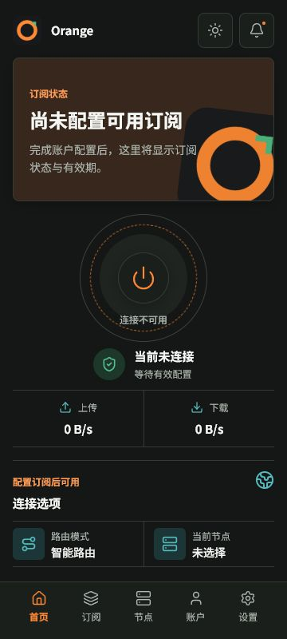
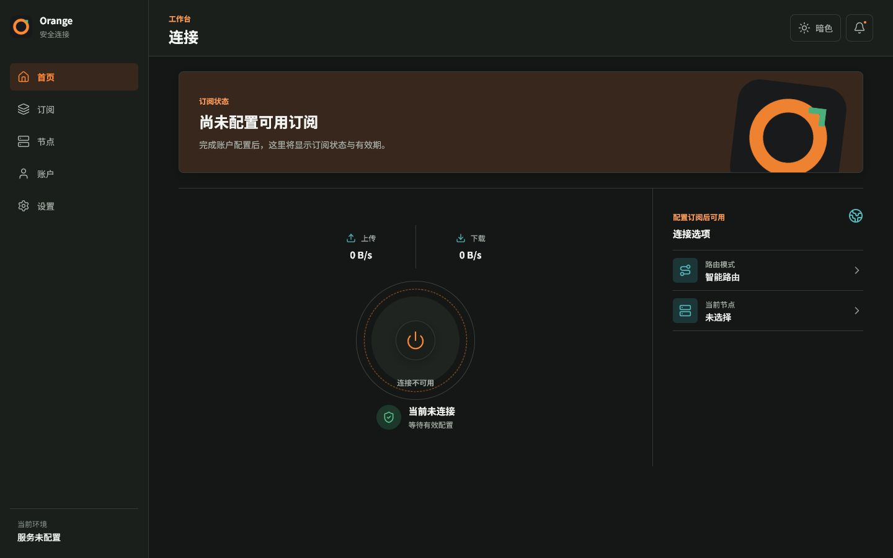

# UI-G0-001 Design Baseline Evidence

- Date: 2026-07-28
- Host: Windows 11 amd64, Chromium in-app browser
- Slice status: `in_progress`

## Qualification Scope

This increment replaces the centered startup placeholder with a reusable,
responsive static connection-home baseline. It qualifies the shared design
tokens, five browser viewport baselines, theme/font/motion examples, and a
machine-readable visual inventory. It does not claim product navigation,
authentication, live Data Plane control, native mobile rendering, or final
brand/design approval.

The page does not call Tauri, `fetch`, or any remote URL. Its connection control
is disabled while the static Data Plane state is unconfigured, so the baseline
does not invent an optimistic connected state.

## Design System

`src/designTokens.css` owns the named color, typography, spacing, radius,
shadow, status, touch-target, layout, motion, safe-area, and breakpoint values.
Page CSS consumes those variables and contains no raw color literals, gradient,
or negative letter spacing. Cards use an 8px maximum radius.

The default follows the system theme. Fixed `theme`, `scale`, and `motion`
preview parameters provide deterministic light/dark, normal/130% font, and
full/reduced-motion examples. System `prefers-color-scheme` and
`prefers-reduced-motion` remain supported independently.

The allowlisted, metadata-cleaned Orange development icon is the only bitmap displayed.
Generic controls come from the exact `lucide-react@1.27.0` dependency; no old
reference bitmap, banner, icon, XML, or implementation enters the build.

## Responsive Structure

Mobile layouts include the required 180 CSS-pixel subscription banner, top
entry controls, central connection state, upload/download values, route mode,
node selection, and five-item bottom navigation. All five target items remain
visible at 360x800 without horizontal or vertical overflow.

The 768x1024 tablet baseline retains the full-width touch layout under 130%
font scaling and reduced motion. At 1024 CSS pixels, navigation becomes a real
sidebar and content becomes a separate main workspace. Both desktop baselines
fit one viewport without text clipping or scrollbars.

## Browser Baselines

`contracts/ui/ui-baselines.v1.json` fixes the exact matrix. Every JPEG is
registered as generated browser evidence with `release_allowed: false` and is
verified by both the UI baseline audit and the resource manifest audit.

| Viewport | Theme / accessibility example | SHA-256 |
| --- | --- | --- |
| 360x800 mobile | dark, normal font, full motion | `5c399f30db35b22d1fa374a117282af493d8d27ba2b8ba4f4eb933a642fcf604` |
| 412x915 mobile | light, normal font, full motion | `5e668cf14a8d4ab2d5b686e422da4fd1d746e9f78f1ac22c5c7323457ef89e45` |
| 768x1024 tablet | dark, 130% font, reduced motion | `52402f9ef7faec907ddba2d32fc9917da8adc64b30cdbecc46826725be779aa8` |
| 1366x768 desktop | light, normal font, reduced motion | `c90e8d76e851707fa8a1e50816395854722652f343ee29e1e9a6792b05d2e0a4` |
| 1440x900 desktop | dark, normal font, full motion | `13cb1666fa022b00c783596d9e11e87039cef9c24b578ba1a292403146b15c66` |

Browser geometry checks recorded exact viewport/document dimensions, no
horizontal overflow, no clipped target text, a 180px mobile banner, mobile
navigation below 1024px, and desktop sidebar at both desktop sizes. The reduced
motion cases computed a zero-second connection animation. The theme button
changed the root from dark to light, the notification button exposed the
`暂无新通知` status, and the browser console contained no warning or error.

## Automated Gates

Four React tests cover static disconnected content, the disabled connection
control, theme switching, notification status, and strict preview parameters.
Six Python tests cover repository success plus missing token, page color,
viewport/image, network/native behavior, and rejected-vocabulary mutations.

`scripts/security/check_ui_baseline.py` is part of every frontend, quality, and
portable-quality job. It verifies the five-image hash/dimension matrix, resource
registration, required tokens and breakpoints, light/dark/font/motion examples,
Lucide and approved-brand usage, UTF-8 product vocabulary, and absence of page
network/native command wiring.

## Verification Results

The Windows `quality` run passed all 31 steps. That run included all 96 security
unit and mutation tests, all 25 frontend tests, all 58 registered resources, and
all 915 supply-chain dependencies. The separate Windows `desktop-shell` run
passed all four steps, including the freshly built desktop application and its
artifact manifest.

The fresh `target/debug/orange-app.exe` stayed alive for the full eight-second
native smoke interval. The static page did not start the Control Plane sidecar,
which is expected because this slice does not call a native command. The exact
application PID was then stopped; the final `orange-app` and
`orange-control-plane` process counts were both zero.

| Debug artifact | Size (bytes) | SHA-256 |
| --- | ---: | --- |
| `target/debug/orange-app.exe` | 16,864,768 | `e98ddbca4522b6c89a99171fb4126794c17a08b95f8e70a7e42e3c005505a101` |
| `target/debug/orange-control-plane.exe` | 21,835,776 | `86e1f2e62d0bc3ca9aac8dfdbc8654f24d63715b16bba813de3a442b281c5878` |

Both hashes match their generated security artifact manifests. These are
unsigned debug artifacts with `release_allowed: false`; they are runtime proof,
not release candidates.

## Remaining Acceptance Work

The slice remains `in_progress`:

- the static shell is not yet wired to authentication, navigation, or native
  Control/Data Plane state;
- Android, iOS, and macOS native-WebView screenshots and safe-area behavior
  have not been captured on their actual runtimes;
- Windows window chrome, resize extremes, and OS-level 130% text settings need
  native shell review beyond browser viewport emulation;
- final product design and brand approval are unavailable; and
- `UI-G0-002` has established a development-only asset pipeline, but no formal
  release brand or third-party banner authorization is available.

The browser baseline and generated evidence images do not substitute for those
platform and approval inputs.
